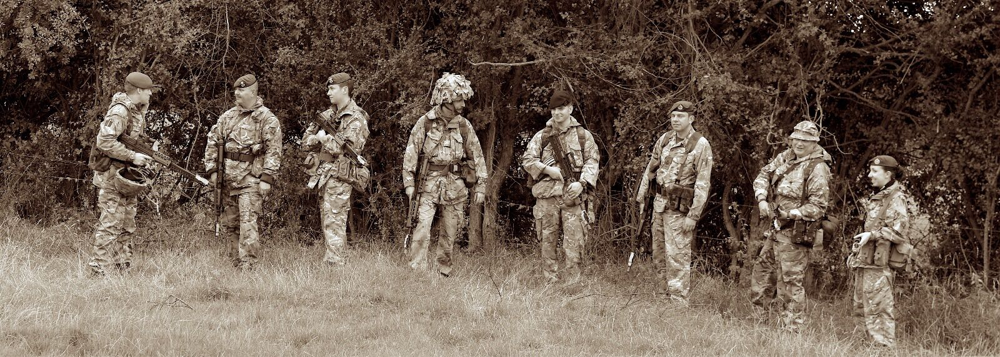

# Danny: The Haynes Manual

---

## ⚠️ STILL TO DO

* [ ] Expand things I love section
* [ ] Expand things I'm shot at 
* [ ] Edit for style and spell check.

---

Hey. I'm Danny. Here's what my Twitter bio says about me:

> **Software Engineer** & **Teacher**. Passionate about technology education and helping people be happy at work. I also play blues music.

You can find me on [Twitter](https://twitter.com/dannysmith), [Medium](https://medium.com/@dannysmith), [GitHub](https://github.com/dannysmith) and [Instagram](https://instagram.com/dannysmith) as `@dannysmith`, and on the web at [danny.is](https://danny.is). You can also find me on [LinkedIn](https://www.linkedin.com/in/dannyasmith), though I rarely use it.

#### ⚠️ This isn't really a manual...

Intruction manuals provide definate instructions on how you should use something. You pretty much have to follow them. Working together is different. It's a *n*-way thing. So this isn't really an instruction manual at all, it's just a load of information about how I *like* to work. It outlines my preferences and peculiarities in the hope that by knowing them up-front, we can find a way to do **amazing work** together.

**I will do my best to adjust my personality style to help with this.**

Nothing in here is set in stone. Nothing is an isntrction, or even a recommendation. It's just a **heads-up**.

Thanks to Dan Barrett for [the idea](https://medium.com/@dasbarrett/a-user-manual-for-dan-d0a285874f72) (he links to a bunch more).

## When I Work Best

I'm a night owl by nature. 🦉

I've tried many times to become a morning person, but after ten years of failed attempts (including 6-months running 3 miles at 6am *every day*), I've realised that it just makes me grumpy and ruins my ability to do good work.

While the realities of life prevent me working my ideal hours (`13:00-16:00` & `19:00-02:00`), I'm rarely at my best first thing in the morning. If you need me at my best, don't book a meeting for 9am if at all possible.

While I'm a firm believer in [Sustainable Pace](http://www.sustainablepace.net/what-is-sustainable-pace), you'll sometimes see me working late at night. This will almost always be because I want to. On no account should abybody feel any *obligation* to follow my lead, or that doing so will earn brownie points or make them some sort of hero.

While we're on the subject of **work-life balance**, I tend to mix the two together. Experience says that, for me, seperating them is detrimental to both. Thins means that you will sometimes find me doing "life" things at work, and "work" things at home. That said, if a strict seperation of the two works for you, I **totally respect that**, and expect everyone else to.

## My Oddities and Flaws

> **HOLMES**: I have my eye on a suite in Baker Street which would suit us down to the ground. You don’t mind the smell of strong tobacco, I hope?
> 
> **WATSON**: I always smoke *Ship's* myself,
> 
> **HOLMES**: That's good enough. I generally have chemicals about, and occasionally do experiments. Would that annoy you?
> 
> **WATSON**: By no means.
> 
> **HOLMES**: Let me see–what are my other shortcomings? I get in the dumps at times, and don't open my mouth for days on end. You must not think I am sulky when I do that. Just let me alone, and I'll soon be right. What have you to confess now? **It's just as well for two fellows to know the worst of one another before they begin to ~~live~~ work together**.

According to Myers-Briggs, I'm an **ENTJ**. I'd highly reccomend [reading my profile](https://www.16personalities.com/entj-personality) – it's scarily accurate (I'd also love you to send me yours). Here's a paragraph from it:

> ENTJ friendships are built on ideas, and a lot of what they find enjoyable is the repartee of putting thoughts forward and defending them from assault from every angle. People with the ENTJ personality type are very smart and highly critical, and they won't back down if they are put on the defensive – in fact, **there’s no better way to earn their respect**.

> It’s not easy to stand up to a personality as big and blustery as ENTJ's, and they too often find that others crumple under the force they apply when they really start to enjoy themselves.

This describes me fairly accurateley. I *reall enjoy arguing*.

##### Key points on arguing

* You will not hurt my feelings by arguing with me – quite the opposite!
* I have a lot of ideas, and most of them are shit. Please be blunt and shoot them down with no regard for my feelings (it's the only way I'll have any better ones).
* I reverse my decisions **very** quickly when presented with a compelling counter-argument.
* If it's feels like I'm having a dig at you, I honestly don't mean it that way.
* I will probably talk over you. **Please talk over me**, and if that's not how you roll then then tell me bluntly to shut up – providing you feel comfortable doing so.
* I'm **acutely** aware that not everyone else is like this, and I can make people feel uncomfortable. If the above sounds like hell to you, please tell me (see *Feedback* below). I'll moderate my behaviour.

Despite all this, I subscribe to the "strong opinions, loosely held" school of thought, and like to [disagree and commit](https://en.wikipedia.org/wiki/Disagree_and_commit) if a dabate has run out of new logical arguments.

### Things I need

* **Movement**. My worst nightmare is a week of 8-hour days sat silently at my laptop. I need to move and wave my arms about, and I need to talk. This means I really like pairing. I love walking meetings, and walk about a lot when I'm thinking - I'm sorry if this is distracting.
* **Variety**. While I can be very happy doing a single type of work (say coding) for quite a long time, the longer I do it the more I crave something different once it's done. The exception to this is work that is inherantly varied, like coaching and project-management.
* **An [oppo](https://www.urbandictionary.com/define.php?term=oppo&defid=219610)**. I work fine alone, but am happer when I've got a partner(s) in crime. I need someone to bounce ideas of and to challenge me.
* **Transparency**. I need to have open conversations and the more I feel involved in bigger business decisions, the more engaged I'll be.
* **Autonomy**. I really need to feel trusted, and to be given autonomy.

### Things I love

* Designing systems and solving systems-related problems. I find systems that involve people.
* Building tools that make people's lives easier. Because programmers are people, this means I really enjoy building tools and abstractions to make programmers lives easier, too.
* Clean, well-structured code that's east to read and reason about.
* Clean, well-designed business systems that are easy to use and reason about.

### Things I find hard

* **Appearing to Listen**.
* **Asking for Help**. Paeticularly when I feel like I *shouldn't need help* with a thing. I'm trying to get better at this.
* **Being on time**. I'm much better at this than I used to be, but will ocasionally be 5 minutes late for things. When I am, be aware that I'm *very very concious* of it and will feel shit about it all day. If I'm late for something and it inconviniences you, be sure to tell me.

## Managing my Work

I've been using [GTD](https://en.wikipedia.org/wiki/Getting_Things_Done) for fourteen years. I even had a [Hipster PDA](https://en.wikipedia.org/wiki/Hipster_PDA) back in the day.

If you ask me to do something, it will get added to my [list](https://culturedcode.com/things/). If it's urgent, has a deadline or is blocking your work then please make that **really clear** to me. It will save you nagging me later.

## Smoking 🚬

I smoke fairly heavily. This means that I'll dissapear from my desk regularly. If I'm stumped by a problem I use the time away from my laptop to think about it. Otherwise, I tend to catch up on Slack and GitHub notifications while I'm smoking.

If we're pairing on something and you feel like I'm timing my smoke breaks badly, just tell me there and then.

## Meetings & Interruptions

If something is in my calendar, I **will always turn up for it**. With that in mind, please don't invite me to meetings "just so I'm aware it's happening" – email or Slack me instead. Equally, if you want my time for any reason, please feel free to put something in my calendar (ideally with at least 24 hours notice). If I accept, **it's a date**. If you know what you want to talk about, tell me in advance so I can prepare my brain and dig out any relevant stuff.

This shouldn't put you off **coming over and talking to me**. I'm always open to that.

If I'm in the office I'm **always interruptable**, even if I have my headphones on. If I need to really focus I'll either go home or leave the office, so if you see me working in a coffee shop, please don't interrupt me.

## Communications

Although I check my emails regularly, I only deal with them in batches. I'll usually reply to important email within 24 hours, but will often "batch process" the rest once a week. I will *eventually* respond to all emails that ask for one.

I'm not a fan of **Reply to All** and usually just reply to the sender unless I think my response will be valueble to everyone. Because of this, it can sometimes look like I'm ignoring other people's emails – this probably isn't the case.

I prefer Slack as my main communication channel, and will see `@mentions` within half an hour or so unless I'm in Lockdown™ and have DND switched on (this is pretty rare if I'm in the office).

If you need something urgently, send me a Slack DM. I will always be notified of these. Or come and talk to me in person if we're both in the office.

I'm happy for anyone to share my personal email address and mobile number (inside or outside the company), though I don't usually answer my phone to unknown numbers. That said, I will respond to a **Voicemail** or **WhatsApp** message explaining who the caller is. If you're sharing my number with someone else, please tell them this.

## Feedback

I **really value feedback**, even if sometimes it donesn't seem like it. Some points to bear in mind:

* If we're mid-debate, immediate feedback will never elicit an emotional response. You can be as rude and abrupt as you like (see above).
* If your feedback is not heat-of-the-moment, my initial response will be emotional, however you deliver it. **I will be defensive**. I'm working on this.
* I value considered feedback over heat-of-the-moment feedback. The latter is just "good conversation" to me, no matter how harsh.
* I prefer you to give feedback in whatever way feels best to you: be that in-person, by email or by carrier pigeon.
* Do not pull your punches (but be ready for me to politely punch back).
* If I feel you lack some context that I have, I'll be **really keen** to provide that context and see if your feedback remains the same.

To be clear: I value **all** feedback, and **want to hear it ALL**. But I reserve the right to decide how I use it.

📝 If you feel more comfortable giving anonymous feedback, [you can do so here](http://c.danny.is/qPXI).

## More on Me

I live in a lovely house in Islington with some friends. I buy a lot of books on business and self-improvement but read at a slower rate than I buy so if you want to borrow a book, I have quite a few.

I used to sing a lot of blues music. You can see some [here](https://danny.is/singing) and [here](https://www.facebook.com/dannysmithmusic/videos/). If you're into blues and fancy a jam, I'm game 🎶.

I've spent the last seven years working with some truly exceptional people to deliver Skill-at-Arms courses instructors in the [Royal Air Force Air Cadets](https://www.raf.mod.uk/aircadets/). I've been an instructor in the air cadets for 11 years. I'm the one in the middle:

